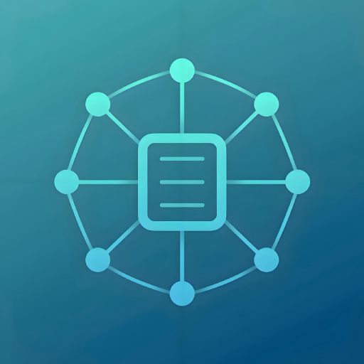
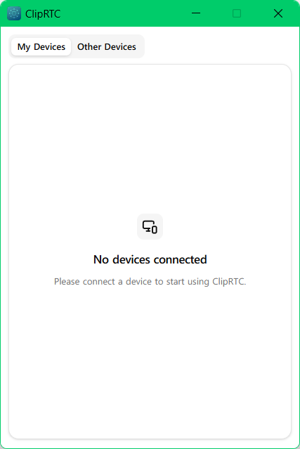
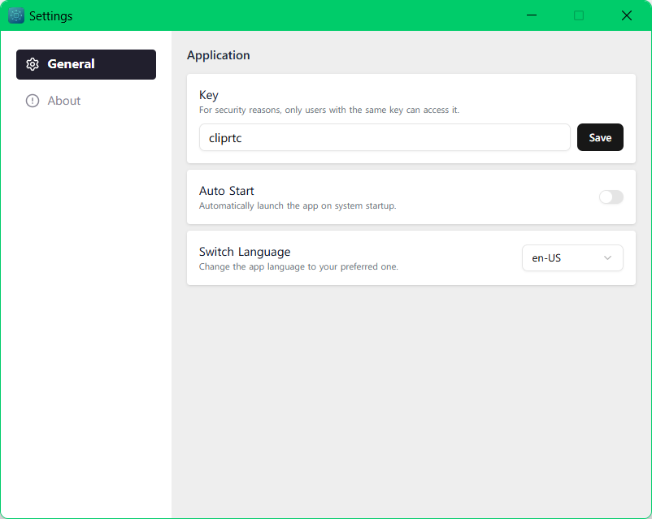

# 📌 ClipRTC

<p>
  
  A real-time LAN clipboard sharing application built with <b>Rust + Tauri v2</b> and <b>React</b>, 
  designed for secure, fast, and seamless clipboard synchronization across multiple devices 
  <b>within the same local network</b>.
  <br><br>
  Lightweight, privacy-friendly, zero configuration — your clipboard, everywhere on the LAN.
</p>
<br>

## 🖼️ Screenshots

<p align="center">
  
  
</p>

## ✨ Main Features

* ⚡ **Cross-platform**
  Built on Tauri v2 — fast launch, tiny memory usage

  Supports Windows / macOS / Linux

  *(🚧 Android / iOS planned)*

* 🔍  **Auto device discovery**

  mDNS-SD ensures plug-and-sync experience — **no manual IP setup**

* 📋 **Multi-type clipboard sync**

  * Text
  * Images
  * Files
  * Directories (recursive)

* 🔐 **Private & secure**

  Peer-to-peer encrypted transmission with QUIC + TLS

  **No cloud. No tracking. No data stored.**

* 🌍 **Internationalization**

  Multi-language UI support (configurable in settings)

> Designed for homes, offices, and local collaborative environments —
> **Make clipboard sharing truly instant and offline.**

## 🚀 Quick Start

### 1️⃣ Download & Install

Get the latest version from Releases:

👉 [https://github.com/cliprtc/cliprtc/releases](https://github.com/cliprtc/cliprtc/releases)

Installation packages available for:

* Windows: `.msi` / `.exe`
* macOS: `.dmg`
* Linux: `.AppImage` / `.deb`

### 2️⃣ Launch & Use

* Ensure devices are connected to the **same LAN**
* Start ClipRTC — devices appear automatically
* Copy → Sync → Done 🎯

> If ClipRTC improves your workflow, please ⭐️ Star our repo!
>
> Your support keeps the project alive 🙌

## 🛠️ Local Development

```bash
# Clone repository
git clone https://github.com/cliprtc/cliprtc.git
cd cliprtc

# Install pnpm
npm install -g pnpm

# Install dependencies
pnpm install

# Development mode
pnpm tauri dev

# Build release binaries
pnpm tauri build
```

📂 Project structure overview:

```
/src-tauri  —— Rust backend (QUIC service, mDNS discovery)
/src        —— React UI (clipboard interaction & views)
```

## ❓ FAQ

1. **Does it require internet or a remote server?**

   ✘ No — everything runs on LAN only.

2. **Is clipboard data stored anywhere?**

   ✘ No — real-time transmission only, no persistence unless you copy again.

3. **Does it work across subnets / VPN?**

   ❓ It depends — current version focuses on same-subnet LAN via mDNS.

4. **Does it support mobile platforms?**

   🚧 Planned with Tauri Mobile support in the future.

## 🤝 Contributing

We welcome all contributions — code, ideas, testing, and feedback ❤️

Steps:
1. Fork this repository
2. Create a branch: `git checkout -b feature/your-feature`
3. Commit and push
4. Submit a Pull Request

## 🙏 Acknowledgments

* [Tauri](https://tauri.app/)
* [React](https://react.dev/)
* [Quinn QUIC](https://github.com/quinn-rs/quinn)
* [mdns-sd](https://github.com/keepsimple1/mdns-sd)
* [clipboard-rs](https://github.com/ChurchTao/clipboard-rs)

## 📄 License

This project is licensed under the **MIT License**.
